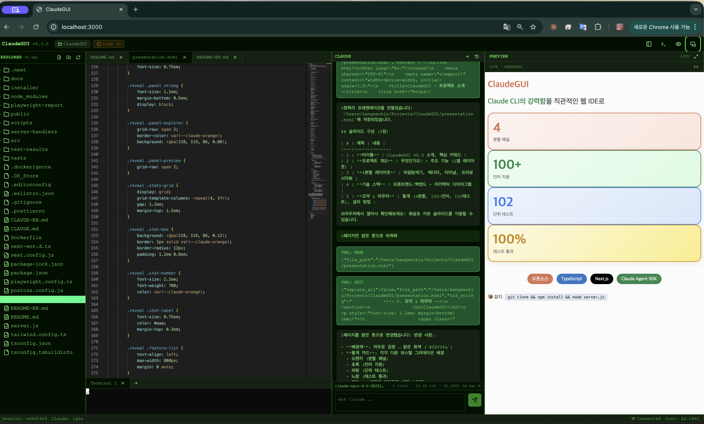
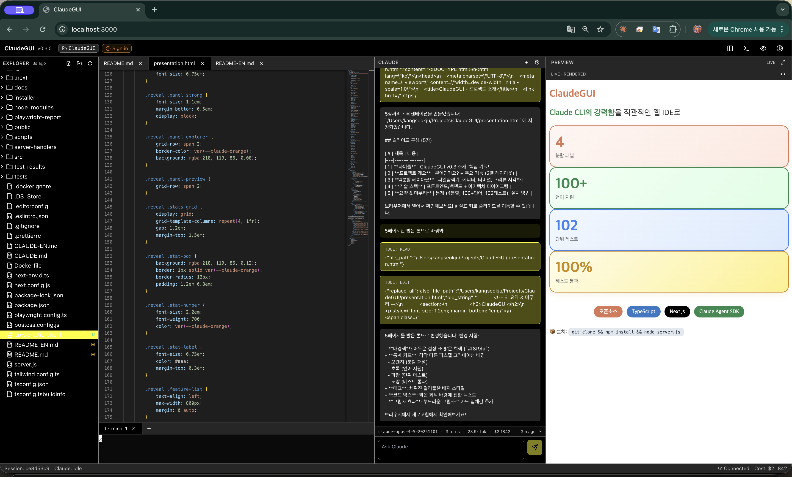
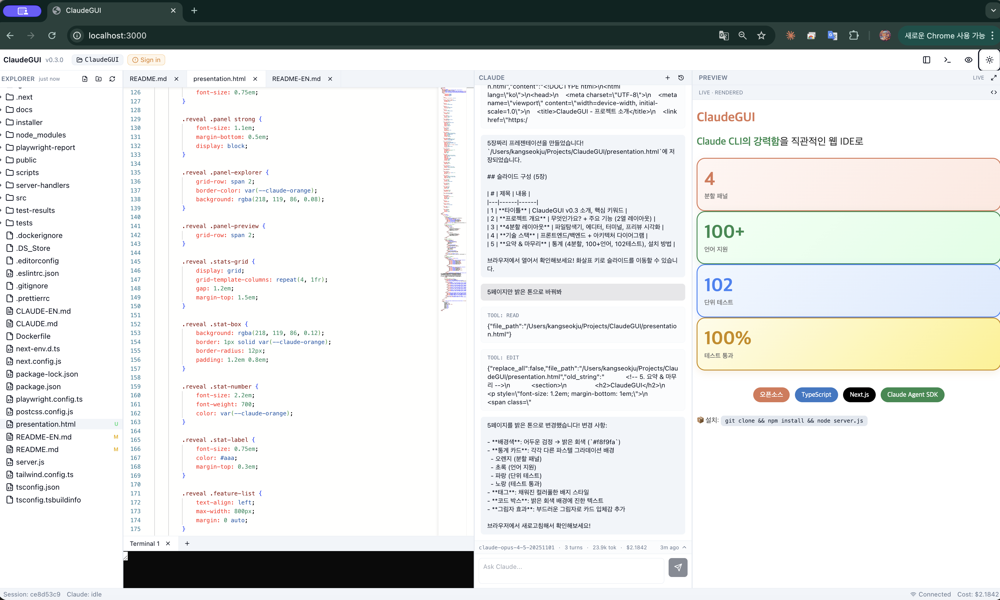

# ClaudeGUI





> 🌐 **Language / 언어**: [한국어](./README.md) · [English](./README-EN.md)

> ⚠️ **Disclaimer**: This project is an **unofficial**, community-maintained effort and has **no affiliation** with **Claude Code** or **Anthropic**. Anthropic, Claude, and Claude Code are trademarks of Anthropic, PBC. This project is not endorsed, sponsored by, or affiliated with Anthropic in any way.

A web-based IDE that wraps Anthropic's Claude CLI. A four-panel layout (file explorer, Monaco editor, terminal, multi-format preview) lets you chat with Claude while editing and previewing code, documents, and presentations in real time.

> This file is the English mirror of [`README.md`](./README.md). Both files must be updated together — see [CLAUDE-EN.md](./CLAUDE-EN.md#bilingual-documentation-policy).

> **Status**: v0.3 extension complete — type check, lint, unit tests (**102/102**), Next build, and Playwright E2E (**14/14**) all pass. **Runtime project hot-swap** (switch projects from the header), **Claude CLI auth integration** (auto-detects `~/.claude/.credentials.json` + header badge), **HTML live streaming preview** (with fullscreen mode), **Green Phosphor CRT retro theme** option, **GitHub one-line install scripts** (macOS/Linux + Windows), and a **Tauri v2 + Node sidecar native installer** (`.dmg`/`.msi`) scaffold are all landed.

---

## Key Features

- **Four-panel layout** — `react-resizable-panels`, collapsible, resizable, auto-persisted to `localStorage`
- **Monaco code editor** — VS Code engine, 100+ language grammars, multi-tab, AI diff accept/reject UI
- **xterm.js terminal** — WebGL-accelerated, ANSI 256 colors, multi-session, backpressure control
- **Claude CLI integration** — Streaming queries via `@anthropic-ai/claude-agent-sdk`, session management (resume/fork), cost/token tracking
- **Permission request GUI** — Intercepts Claude tool invocations and shows an approve/deny modal, warns on dangerous commands, integrates with the `.claude/settings.json` allow/deny list
- **Multi-format live preview**
  - HTML (sandboxed iframe srcdoc)
  - PDF (react-pdf, page navigation)
  - Markdown (GFM, LaTeX, code highlighting)
  - Images (zoom/pan)
  - Presentations (reveal.js)
- **Conversational slide editing** — Ask Claude for changes in natural language and see them applied instantly via `Reveal.sync()` without an iframe reload; export to PPTX/PDF
- **File explorer** — Virtualized tree (`react-arborist`), Git status indicators, drag-and-drop, context menu
- **Real-time file sync** — chokidar detects filesystem changes and broadcasts them over WebSocket so the editor refreshes automatically
- **Command palette** — `Cmd+K` / `Ctrl+Shift+P` (cmdk-based), quick open (`Cmd+P`), panel toggles
- **Generated Content gallery** — Automatically extracts HTML/SVG/Markdown/code artifacts produced by Claude and surfaces them in a popup. Persisted to `localStorage` with one-click clipboard copy and exports to Source, HTML, PDF (via the print dialog), Word (.doc), and PNG (for SVGs)

## Architecture at a Glance

```
Browser (Next.js + React)
  │
  │ WebSocket + REST
  ▼
Custom Node.js server (server.js)
  ├── /ws/terminal  → node-pty
  ├── /ws/claude    → Claude Agent SDK
  ├── /ws/files     → chokidar
  └── /api/files/*  → fs (sandboxed)
```

- **Custom server is required**: serverless deployments (Vercel, etc.) are not supported because WebSocket, long-lived sessions, and local PTY are required.
- **Local-first**: binds to `127.0.0.1` by default; use an SSH tunnel or Cloudflare Tunnel for remote access.
- See [docs/en/architecture/](./docs/en/architecture/) for details.

## Tech Stack

| Layer | Technology |
|-------|-----------|
| Framework | Next.js 14+ (App Router) + custom `server.js` |
| Language | TypeScript (strict) |
| UI | React 18+, Tailwind CSS, shadcn/ui (Radix) |
| State | Zustand v5 |
| Editor | @monaco-editor/react |
| Terminal | @xterm/xterm v5 + node-pty |
| File tree | react-arborist v3.4 |
| Panels | react-resizable-panels v4 |
| Preview | react-pdf, react-markdown, reveal.js |
| WebSocket | ws v8 (not socket.io) |
| CLI integration | @anthropic-ai/claude-agent-sdk |
| File watching | chokidar v5 (ESM) |
| Command palette | cmdk |

The full dependency list and rationale are in [docs/en/architecture/01-system-overview.md](./docs/en/architecture/01-system-overview.md).

## Prerequisites

| Tool | Minimum version | Notes |
|------|-----------------|-------|
| Node.js | 20.0+ | chokidar v5 ESM, node-pty |
| npm | 10.0+ | — |
| Claude CLI | latest | `npm install -g @anthropic-ai/claude-code` |
| Python 3 | 3.8+ | node-pty native build |
| C++ build tools | — | macOS: `xcode-select --install` / Windows: Visual Studio Build Tools / Linux: `build-essential` |
| Chrome | latest 2 versions | primary target browser |

You also need an Anthropic Claude Pro/Max/Team/Enterprise subscription and `ANTHROPIC_API_KEY` or `ANTHROPIC_AUTH_TOKEN`.

## Install & Run

### One-line install (recommended)

**macOS / Linux**:
```bash
curl -fsSL https://raw.githubusercontent.com/anthropics/ClaudeGUI/main/scripts/install/install.sh | bash
```

**Windows (PowerShell)**:
```powershell
iwr -useb https://raw.githubusercontent.com/anthropics/ClaudeGUI/main/scripts/install/install.ps1 | iex
```

The script provisions Node.js 20+, the Claude CLI, the ClaudeGUI checkout, and the `claudegui` launcher. Every destructive step prompts for confirmation (`--yes` for non-interactive, `--dry-run` to only print the plan).

### Native app (`.dmg` / `.msi`)

Starting in v0.3 a Tauri v2 native installer can be built from `installer/tauri/`. The release CI workflow (`.github/workflows/release.yml`) produces macOS (arm64/x86_64) `.dmg` and Windows x86_64 `.msi` on tag push.

### Run from source

```bash
git clone https://github.com/anthropics/ClaudeGUI.git
cd ClaudeGUI
npm install
cp .env.example .env.local   # optional — set PROJECT_ROOT
node server.js
```

Open `http://localhost:3000` in your browser. **Claude CLI authentication**: run `claude login` inside the built-in terminal and credentials persist to `~/.claude/.credentials.json` — no separate `ANTHROPIC_API_KEY` needed.

### Production build

```bash
npm ci
npm run build
NODE_ENV=production node server.js
```

### Docker

```bash
docker build -t claudegui:latest .

docker run -d \
  --name claudegui \
  -p 127.0.0.1:3000:3000 \
  -v /Users/dev/myproject:/workspace:rw \
  -e PROJECT_ROOT=/workspace \
  -e ANTHROPIC_API_KEY="$ANTHROPIC_API_KEY" \
  claudegui:latest
```

For the full deployment guide see [docs/en/architecture/06-deployment.md](./docs/en/architecture/06-deployment.md).

## Environment Variables

```bash
# .env.local
HOST=127.0.0.1
PORT=3000
PROJECT_ROOT=/Users/dev/myproject   # file-system sandbox root
ANTHROPIC_API_KEY=sk-ant-...        # or ANTHROPIC_AUTH_TOKEN
LOG_LEVEL=info                      # debug | info | warn | error
NODE_ENV=development
```

## Keyboard Shortcuts

| Shortcut | Action |
|----------|--------|
| `Cmd/Ctrl + K` | Command palette |
| `Cmd/Ctrl + P` | Quick open file |
| `Cmd/Ctrl + B` | Toggle sidebar |
| `Cmd/Ctrl + J` | Toggle terminal |
| `Cmd/Ctrl + S` | Save file |
| `Ctrl + F` (in terminal) | Search terminal buffer |

## Project Structure

```
ClaudeGUI/
├── CLAUDE.md                 # Korean conventions & change workflow
├── CLAUDE-EN.md              # English mirror of CLAUDE.md
├── README.md                 # Korean README
├── README-EN.md              # English mirror of README.md
├── server.js                 # Custom Node.js server (WS + Next.js)
├── docs/
│   ├── research/             # Historical planning documents
│   ├── srs/                  # Software Requirements Specification (Korean, FR/NFR/UC)
│   ├── architecture/         # Architecture design (Korean, ADRs, components, data flow, API, security)
│   └── en/                   # English mirrors
│       ├── srs/
│       └── architecture/
├── src/
│   ├── app/                  # Next.js App Router (pages, api routes)
│   ├── components/
│   │   ├── ui/               # shadcn/ui primitives
│   │   ├── panels/           # file-explorer, editor, terminal, preview
│   │   └── layout/
│   ├── stores/               # Zustand stores (layout/editor/terminal/claude/preview)
│   ├── lib/
│   │   ├── websocket/        # WS client
│   │   ├── fs/               # Filesystem sandbox (server)
│   │   ├── claude/           # Agent SDK wrapper (server)
│   │   └── pty/              # PTY bridge (server)
│   └── types/
└── tests/
    ├── unit/
    ├── integration/
    └── e2e/
```

> **Note**: ClaudeGUI v1.0 uses no persistent database. Claude sessions are managed by the Claude CLI under `~/.claude/projects/`, and UI layout preferences live in the browser's `localStorage`.

## Documentation

- **[CLAUDE-EN.md](./CLAUDE-EN.md)** — Code conventions, mandatory change workflow, things to avoid
- **SRS (Software Requirements Specification)** — [docs/en/srs/](./docs/en/srs/)
  - [01. Introduction](./docs/en/srs/01-introduction.md)
  - [02. Overall description](./docs/en/srs/02-overall-description.md)
  - [03. Functional requirements (FR-100~900)](./docs/en/srs/03-functional-requirements.md)
  - [04. Non-functional requirements (NFR-100~500)](./docs/en/srs/04-non-functional-requirements.md)
  - [05. Use cases (UC-01~08)](./docs/en/srs/05-use-cases.md)
  - [06. External interfaces](./docs/en/srs/06-external-interfaces.md)
  - [07. Constraints and assumptions](./docs/en/srs/07-constraints-and-assumptions.md)
- **Architecture design** — [docs/en/architecture/](./docs/en/architecture/)
  - [01. System overview & ADRs](./docs/en/architecture/01-system-overview.md)
  - [02. Component design](./docs/en/architecture/02-component-design.md)
  - [03. Data flow](./docs/en/architecture/03-data-flow.md)
  - [04. API design](./docs/en/architecture/04-api-design.md)
  - [05. Security architecture](./docs/en/architecture/05-security-architecture.md)
  - [06. Deployment & operations](./docs/en/architecture/06-deployment.md)

## Development Workflow

**Every feature change MUST follow the Mandatory Workflow in [CLAUDE-EN.md](./CLAUDE-EN.md).**

### Before the change

1. Review relevant FR/NFR items in `docs/srs/` (or `docs/en/srs/`) and assess fit.
2. Review component/data-flow/ADR impact in `docs/architecture/` (or `docs/en/architecture/`).
3. If you find a mismatch, stop and align with the team before writing code.

### After the change (all required)

1. Update `docs/srs/` (FR/NFR; use cases if needed) **and** the English mirror under `docs/en/srs/`.
2. Update `docs/architecture/` (add an ADR if the change is architectural) **and** the English mirror under `docs/en/architecture/`.
3. Add/update tests under `tests/` and ensure the full suite passes.
4. Update `README.md` **and** `README-EN.md`.
5. If CLAUDE rules themselves change, update both `CLAUDE.md` and `CLAUDE-EN.md`.
6. (If applicable) DB migrations under `migrations/` — v1.0 has no DB.

## Scripts

```bash
npm run dev          # dev server (node server.js)
npm run build        # Next.js production build
npm start            # production server
npm run lint         # ESLint
npm run type-check   # TypeScript compile check
npm test             # unit tests (Vitest)
npm run test:e2e     # E2E tests (Playwright)
npm run run:local    # scripts/dev.sh — one-shot local launcher (see below)
npm run run:clean    # --clean --build (fresh build then run)
npm run run:debug    # --verbose --trace (all modules + stack traces)
```

### Local launch script — `scripts/dev.sh` (v0.3)

Optionally runs clean / install / type-check / lint / test / build, then launches `node server.js` in the **foreground by default**. Use `--background` to run detached and manage the process with `--stop`/`--restart`/`--status`/`--tail`. Output is filtered **per module** with color coding.

```bash
# Foreground (default)
./scripts/dev.sh                                    # fast dev boot
./scripts/dev.sh --clean --build                    # full rebuild
./scripts/dev.sh --prod --port 8080                 # production mode
./scripts/dev.sh --debug files,claude,project       # filter to specific modules
./scripts/dev.sh --verbose --trace                  # all modules + stack traces
./scripts/dev.sh --log-file /tmp/gui.log            # tee to file in addition to terminal

# Background (detached)
./scripts/dev.sh --background --verbose             # detach + auto log file
./scripts/dev.sh --background --tail                # detach then follow the log
./scripts/dev.sh --background --log-file /tmp/gui.log --log-truncate

# Lifecycle
./scripts/dev.sh --status                           # show running instance state
./scripts/dev.sh --tail                             # follow the log (server keeps running)
./scripts/dev.sh --stop                             # graceful SIGTERM → 5s → SIGKILL
./scripts/dev.sh --stop --force-kill                # immediate SIGKILL
./scripts/dev.sh --restart --debug '*'              # stop + relaunch in background
./scripts/dev.sh --help                             # full option list
```

**Available debug modules** (`--debug <list>`, use `*` for everything):
| Module | Output |
|--------|--------|
| `server` | server.js boot/shutdown |
| `project` | `ProjectContext` root changes + persistence |
| `files` | `/ws/files` watcher create/restart/broadcast |
| `terminal` | node-pty spawn/exit |
| `claude` | `/ws/claude` queries/permissions/events |

**Option categories**:
- Preparation: `--clean` `--install` `--check` `--lint` `--test` `--build` `--all-checks`
- Run mode: `--dev` (default) / `--prod`
- Server: `--host <addr>` `--port <n>` `--project <path>` `--kill-port`
- Debug: `--debug <list>` `--verbose` `--trace` `--log-level <lvl>` `--inspect` `--inspect-brk` `--log-file <path>` `--log-truncate` `--no-color`
- Background / lifecycle: `--background` `--stop` `--restart` `--status` `--tail` `--pid-file <path>` `--force-kill`
- Convenience: `--open` `--help`

**State paths** (overridable via `CLAUDEGUI_STATE_DIR` / `CLAUDEGUI_PID_FILE` / `CLAUDEGUI_LOG_DIR`):
- PID file: `~/.claudegui/claudegui.pid`
- Default log file: `~/.claudegui/logs/claudegui.log` (background mode default, appended)

On Windows, `scripts/dev.ps1` offers the same functionality (`.\scripts\dev.ps1 -Help`).

Implementation: `scripts/dev.sh`, `scripts/dev.ps1`, `src/lib/debug.mjs` (module filter + color mapping + optional stack traces).

## Security

- The server binds to `127.0.0.1` by default.
- All filesystem APIs apply `resolveSafe()` path sandboxing.
- Dotfiles (`.env`, `.git`, `.ssh`) are blocked.
- iframe previews use `sandbox="allow-scripts"` (`allow-same-origin` is forbidden).
- Markdown runs through `rehype-sanitize` to prevent XSS.
- API keys live only in server-side environment variables (never exposed to the frontend).
- Claude tool invocations surface a GUI permission modal.

The full threat model and mitigations are in [docs/en/architecture/05-security-architecture.md](./docs/en/architecture/05-security-architecture.md).

## Troubleshooting

| Symptom | Fix |
|---------|-----|
| `Cannot find module 'node-pty'` | `npm rebuild node-pty` or install OS-specific build tools |
| WebSocket connection fails | Use `node server.js` instead of `next dev` |
| Monaco fails to load | Check CDN access; consider a local bundle fallback |
| PDF viewer worker 404 | Check browser console; verify `workerSrc` version in `pdf-preview.tsx` |
| Path sandbox 403 | Double-check the `PROJECT_ROOT` env var |
| `claude` command not found | `npm install -g @anthropic-ai/claude-code` |
| Git status not displayed | Confirm the project root is a Git repo (`git init`) |
| Agent SDK events ignored | Compare the event type mapping in `server-handlers/claude-handler.mjs` with the actual SDK version |

## What's new in v0.3

- **Runtime project hot-swap** — click the project button in the header to switch to a different directory. The file explorer, terminal, and Claude query `cwd` all update automatically, and recents persist to `~/.claudegui/state.json`. (FR-908, ADR-016)
- **Claude CLI auth badge** — the header shows a live auth indicator (`🟢 Claude` signed in / `🟡 Sign in` not signed in / `⚫ CLI missing`). Clicking opens a `claude login` guidance modal. (FR-510)
- **HTML streaming live preview** — when Claude emits a ` ```html ` block or uses the `Write`/`Edit` tool on a `.html` file, the Preview panel renders partial chunks immediately, then the full render on completion. While incomplete, a source view is shown as a fallback. Fullscreen mode (Esc to exit). (FR-610, FR-611, ADR-017)
- **Green Phosphor CRT retro theme** — select "Theme: Retro — Green Phosphor" from the command palette for a VT100-style green phosphor look with optional scanlines. The default remains the current dark theme. (NFR-302)
- **One-line install scripts** — `curl | bash` / `iwr | iex` (see the Install section above).
- **Tauri v2 native installer** — `installer/tauri/` scaffold plus release CI workflow. Node sidecar and app-local Claude CLI prefix. (ADR-018)

## Known Limitations (v0.1)

- **Permission mode**: The app uses Agent SDK `permissionMode: 'default'`. Safe Bash commands (e.g., `echo`) are auto-approved by the SDK, so `canUseTool` is not called for them. This is intentional — the GUI modal only shows for file writes/edits/dangerous commands. Every tool invocation is still logged in the chat panel as a tool message.
- **node-pty**: Verified on Node 20+ and macOS Apple Silicon with `node-pty@1.2.0-beta.12`. The earlier `1.1.0` release fails with `posix_spawnp failed` on Node 24, so building requires at least `1.2.0-beta`.
- **Session resume/fork**: JSONL files under `~/.claude/projects/` are parsed read-only; after a fork, the first query relies on the Agent SDK's session-creation behavior.
- **AI diff view**: Monaco `DiffEditor` is combined with LCS-based hunk decomposition, enabling per-hunk checkbox selection plus "Apply N hunks" for partial acceptance. "Reject all" restores the original; "Select all" auto-checks every hunk.
- **Session management**: The session list Resume action parses message history from `~/.claude/projects/*.jsonl` into the UI and then continues the conversation via the Agent SDK `resume` option. Fork starts a fresh SDK session while displaying the original session id as a reference.
- **Permission rules UI**: The command palette action "Edit Permission Rules" provides CRUD for `permissions.allow` / `deny` entries in `.claude/settings.json`. Examples: `Bash(npm test:*)`, `Edit`, `Read(~/**)`.
- **Streaming deltas**: The current Agent SDK emits the full assistant message in a single event, so there is no token-by-token typing effect. Token deltas will be added once the SDK supports `stream-json` delta events.
- **Next.js dev HMR WebSocket**: The custom server uses a `didWebSocketSetup` bypass. Re-verify against any major Next.js upgrade.

## License

TBD

## Contributing

Issues and PRs are welcome. Before contributing, please read the development workflow in [CLAUDE-EN.md](./CLAUDE-EN.md).
