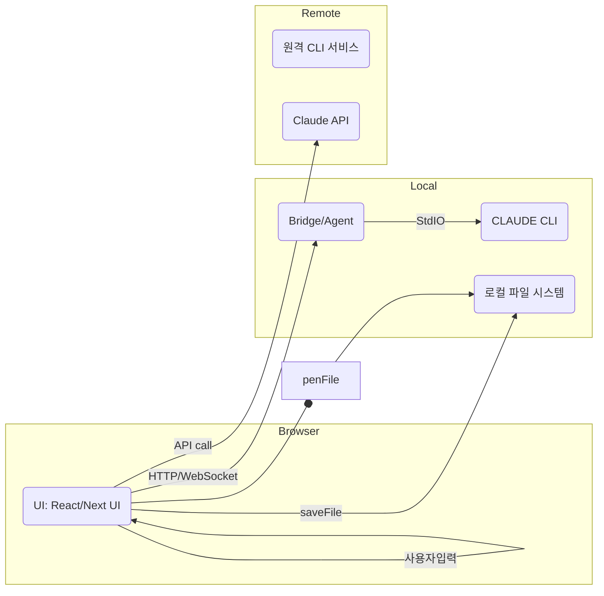
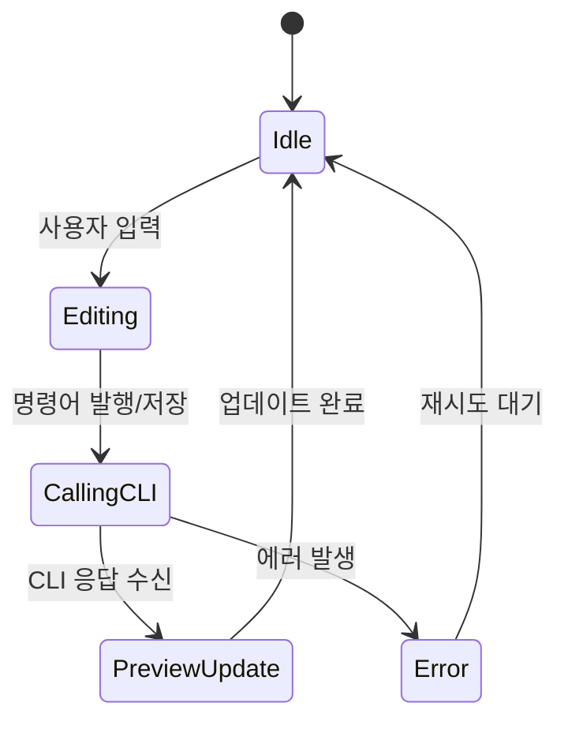
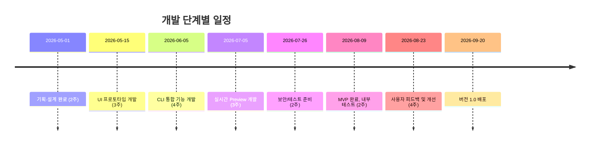

# Executive Summary  
이 보고서는 **Anthropic Claude CLI**를 기반으로 한 웹 기반 AI 에디터 시스템의 기술·제품 기획을 다룹니다. 사용자 친화적인 **UI/UX**를 위해 좌측 파일 탐색기, 중앙 편집기, 우측 실시간 Preview 패널 구조를 제안하며, Chrome 브라우저 환경에서의 **반응형·접근성**을 고려합니다. **Preview 기능**은 HTML, PDF, Markdown, 이미지 등 다양한 콘텐츠를 페이지 단위로 실시간 렌더링하며, 특히 **HTML 기반 PPT** 작성 시 슬라이드(페이지) 추가 및 대화식 편집을 지원합니다. 이를 위해 reveal.js 같은 HTML 프레젠테이션 프레임워크를 활용할 수 있습니다【22†L332-L340】.  
통합 측면에서는 브라우저와 로컬/원격의 Claude CLI 간 통신 방법(프로세스 호출, WebSocket, HTTP 등)을 설계하고, **네이티브 메시징** 또는 로컬 에이전트 형태로 CLI를 호출하는 방안을 논의합니다. **인증·권한 관리**는 API 키나 토큰을 안전하게 처리하며, 로컬 파일 접근 권한을 엄격히 제어합니다. 특히 Chrome Native Messaging은 Chrome이 별도 프로세스로 네이티브 호스트를 실행하고 stdin/stdout을 통해 JSON 메시지로 통신하므로, 메시지 크기(1MB)를 제한한다는 특징이 있습니다【8†L49-L52】.  
기술 스택은 **React + TypeScript + Next.js** 기반으로 하고, 클라이언트 컴포넌트를 활용하여 UI 상호작용과 상태 관리를 처리하며【14†L552-L560】, 필요시 서버 컴포넌트를 통해 API키 관리나 초기 데이터 패칭을 합니다【14†L561-L568】. 편집기는 **Monaco Editor** 또는 **CodeMirror** 같은 코드 편집기를 선택하고(각 장단점 비교 표 참조), **PDF.js**나 **react-markdown** 등 표준 라이브러리로 Preview를 구현합니다. 파일 시스템은 Chrome의 **File System Access API**를 이용해 로컬 파일/폴더를 직접 열고 저장하며【24†L179-L184】, 대용량 파일은 스트리밍 처리 등으로 대응합니다.  
실시간 편집 워크플로우는 사용자가 에디터에서 명령을 입력하면 이벤트 큐를 통해 Claude CLI를 호출하고, CLI 응답을 바탕으로 에디터와 Preview를 갱신합니다. **비동기 호출**과 **디바운싱** 기법으로 지연을 최소화하고, 필요 시 충돌 감지 및 병합 전략을 적용합니다.  
보안·프라이버시 측면에서는 로컬 파일 접근은 사용자의 명시적 허가 하에 수행하며, CLI 실행 시 명령 인젝션 검증, 전송 데이터 암호화(TLS) 등을 적용합니다. 또한 XSS 및 파일 주입 공격을 방지하기 위해 외부 스크립트 로딩을 금지하고 입력을 필터링합니다.  
테스트 계획으로는 **Cypress** 등을 이용한 E2E 테스트 및 컴포넌트 테스트를 수행하며【26†L528-L531】, 유닛 테스트와 보안 테스트(예: 정적 분석)를 병행합니다. 배포·운영은 Next.js 애플리케이션을 Node.js 서버(또는 Vercel)에 배포하고, 로컬 에이전트는 독립 배포하며 CI/CD로 자동화합니다. 모니터링·로깅 시스템(예: Sentry) 도입으로 장애 대응과 성능 추이를 관리합니다.  
일정·인력·비용에서는 MVP 단계와 완전 기능 단계로 구분하여 산출물과 일정(예: 3개월 MVP, 추가 2개월 확장), 역할별 인원(프론트엔드, 백엔드, QA 등), 예상 개발비용을 산정합니다. 마지막으로 기술적·보안적·UX적 리스크와 그 완화 방안을 제시합니다.  

## 1. 전제 검증: Claude CLI 설치·관리  
- **설치 확인:** 시스템 가동 시 로컬 환경에 `ant`(Anthropic CLI 바이너리)가 존재하는지 검사합니다. 예를 들어, 셸 명령어 `ant --version` 또는 `ant -v`를 호출하여 출력 결과로 CLI 설치 여부와 버전을 확인할 수 있습니다【35†L352-L353】. 설치되어 있지 않으면 사용자에게 설치 안내 또는 설치 스크립트를 제공합니다.  
- **버전 관리:** CLI 버전 호환성을 위해 초기 실행 시 또는 주기적으로 `ant --version`으로 현재 버전을 확인하고, 필요한 경우 최신 릴리즈로 업데이트를 유도합니다. 릴리즈 정보는 GitHub나 공식 문서에서 확인할 수 있으며, 버전 업에 따른 API 변경을 주시합니다. 예를 들어 CLI에는 `--version` 플래그가 있어 현재 버전을 알 수 있습니다【35†L352-L353】.  
- **환경관리:** 로컬(macOS/Windows/Linux) 및 원격 서버 시나리오별로 CLI 설치 경로와 권한을 관리합니다. 로컬에서는 사용자의 `$PATH`에 `ant`가 포함되었는지 확인하고, 원격의 경우 도커 컨테이너나 VM에 CLAUD CLI를 미리 설치합니다. 또한 환경 변수(`ANTHROPIC_API_KEY` 등)를 통해 인증정보를 안전하게 설정할 수 있습니다.

## 2. 제품 개요: UI/UX 설계  
- **레이아웃:** 좌측에는 파일/폴더 탐색 패널, 중앙에는 코드/콘텐츠 편집기 패널, 우측에는 Preview 패널을 배치합니다. 각 패널은 접이식(fold/unfold)으로 화면 공간을 조정할 수 있어야 합니다. 예를 들어 패널 경계를 드래그하여 크기 조절이 가능해야 하며, 필요시 아이콘 클릭으로 개별 패널을 접거나 펼칠 수 있습니다.  
- **화면 흐름:** 사용자가 파일을 열거나 명령어를 입력하면 그에 따라 에디터가 업데이트되고, 오른쪽 Preview가 실시간으로 갱신됩니다. 메뉴 바 또는 단축키를 통해 CLI 명령 호출과 저장, 실행 등의 기능을 직관적으로 수행할 수 있어야 합니다.  
- **접근성:** 텍스트 크기 조절, 키보드 내비게이션, 스크린리더 호환성 등을 확보합니다. ARIA 속성 부여 및 시멘틱 마크업으로 구조화하며, 대비가 높은 테마 옵션(다크/라이트)과 포커스 표시를 제공합니다.  
- **반응형 디자인:** Chrome 브라우저에서 주요 해상도(데스크톱, 노트북) 기준으로 적절히 대응합니다. 좌우 패널은 최소 폭 이하가 되면 자동으로 접히도록 하고, 모바일 폭에서는 단일 패널 모드(탭 전환)를 고려할 수 있습니다.  

## 3. 실시간 Preview 요구사항  
- **다중 포맷 지원:** Preview 패널은 HTML, PDF, Markdown, 이미지 등을 페이지 단위로 렌더링해야 합니다. 각 페이지는 “페이지 구분”(예: CSS `page-break`)을 표시하여 사용자에게 현재 어느 페이지가 편집되고 있는지 보여줍니다.  
  - **HTML/PPT:** HTML 기반 프레젠테이션(예: reveal.js) 작성 시 각 슬라이드를 별개 페이지로 취급합니다. 사용자 명령에 따라 슬라이드(페이지)를 추가/삭제/재배열할 수 있어야 합니다. 예를 들어 reveal.js 같은 프레임워크를 사용하면 HTML로 작성된 발표자료를 웹에서 동적으로 생성할 수 있습니다【22†L332-L340】.  
  - **PDF:** PDF 뷰어(예: [PDF.js](https://mozilla.github.io/pdf.js/))를 내장하여 PDF 문서를 페이지별로 표시합니다. 사용자가 편집 중인 내용을 PDF로 내보낼 수 있도록 서버 측 렌더링 기능(예: puppeteer)도 고려합니다.  
  - **Markdown:** Markdown은 라이브러리(예: `react-markdown`, `remark`)로 HTML로 변환하여 렌더링합니다. 코드 블록, 수식, 표 등도 지원해야 합니다. 편집기에서 텍스트를 수정하면 즉시 미리보기가 갱신됩니다.  
  - **이미지:** PNG, JPG 등 이미지는 `` 태그로 표시합니다. 대용량 이미지는 캔버스에 점진 로딩하거나 Web Worker로 디코딩하여 렌더링 지연을 최소화합니다.  
- **라이브 리로딩 및 인크리멘탈 렌더링:** 편집 내용 변경 시 전체 뷰를 다시 그리지 않고 변경된 부분만 갱신합니다. 예를 들어 Markdown 에디터에서 특정 슬라이드 내용만 수정되면 해당 슬라이드만 재렌더링합니다. 이를 위해 Virtual DOM(diff) 기반 업데이트와 디바운싱(debounce)을 조합합니다. 텍스트 입력 이벤트마다 즉시 렌더링하지 않고, 사용자가 멈추면(예: 300ms) 렌더링을 트리거해 불필요한 반복을 줄입니다.  
- **대화식 편집 (Interactive):** 사용자가 편집 도중 명령어를 보내면, CLI의 응답으로 콘텐츠가 변경되고 Preview에 반영되어야 합니다. 예를 들어 “이 슬라이드에 차트 추가”와 같은 자연어 명령을 보낼 때, 그 결과를 실시간으로 확인할 수 있어야 합니다. 이 과정에서 CLI의 출력(JSON, HTML 등)를 에디터 콘텐츠로 변환하여 동기화합니다.

## 4. 통합: Claude CLI와의 통신 설계  
- **통신 방식:** 브라우저는 직접 로컬 프로세스를 실행할 수 없으므로, CLI와의 통신을 위한 브리지(Agent) 또는 중계 서버가 필요합니다.  
  - **네이티브 메시징 (Chrome 확장):** 크롬의 Native Messaging을 활용하면 확장 프로그램이 로컬 네이티브 호스트(예: Node.js 에이전트)를 실행해 `stdin/stdout`으로 CLI를 호출할 수 있습니다. Chrome은 호스트를 별도 프로세스로 구동하며 메시지는 JSON으로 직렬화되어 전송됩니다【8†L49-L52】. 이 방법은 보안적으로 안전하며 사용자 동의 하에 실행 가능합니다. 단, 매니페스트 설정과 설치 과정이 복잡할 수 있습니다.  
  - **로컬 에이전트/서버:** 사용자 PC에서 백그라운드로 동작하는 로컬 Node.js/WebSocket 서버를 두어 브라우저와 CLI 사이를 중계합니다. 브라우저는 WebSocket/HTTP로 요청을 보내고, 에이전트가 `ant` 프로세스를 스폰하여 명령을 실행한 후 결과를 반환합니다. 설치가 간편하고 버전 관리를 쉽게 할 수 있으나, 별도의 데몬 설치가 필요합니다.  
  - **원격 서버:** CLI가 원격 서버에 설치되어 있는 경우, 브라우저는 REST API나 WebSocket으로 원격 서버에 요청을 보냅니다. 서버가 CLI를 호출하여 처리 결과를 리턴합니다. 로컬과 달리 설치 부담이 없으나, 네트워크 지연과 보안(인증 및 데이터 보호) 이슈가 있습니다.  
- **인증·권한·오류 처리:** CLI 호출 시에는 `ANTHROPIC_API_KEY`나 `ANTHROPIC_AUTH_TOKEN`을 사용하여 인증합니다【35†L348-L353】. API 키는 비공개로 관리하며, 필요 시 로그인 UI를 통해 입력받습니다. 에러 발생 시 사용자에게 명확한 메시지(예: 네트워크 오류, CLI 충돌 등)를 제공하며 재시도 옵션을 제공합니다.  
- **브라우저 보안 제약:** 순수 웹앱 환경에서는 로컬 CLI를 직접 호출할 수 없으므로, 앞서 언급한 방식(확장 또는 로컬 서버)을 채택해야 합니다. 특히 Native Messaging은 호스트 명세에 `allowed_origins`로 확장 ID를 등록해야 하며, Chrome 버전(MV3) 제약에 주의해야 합니다. WebRTC, WebSocket은 로컬호스트에 바인딩하거나 HTTPS API로 우회해야 합니다.

## 5. 기술 스택 및 아키텍처  
- **Framework:** **Next.js(React+TypeScript)**를 사용합니다. Next.js의 서버/클라이언트 컴포넌트 모델을 활용하여, 처음 로드 시 간단한 서버 측 렌더링(SSR)으로 화면 뼈대를 구성하고, 복잡한 UI 상호작용은 클라이언트 컴포넌트로 처리합니다【14†L552-L560】【14†L561-L568】. SEO가 필요 없고 실시간 업데이트가 주 목적이므로 대부분의 컴포넌트는 클라이언트 사이드 렌더링(CSR)으로 구현합니다.  
- **상태 관리:**  
  - **Redux / Zustand / Context + Hook:** 에디터 내용, 파일 리스트, 사용자 설정 등 글로벌 상태는 Context API 또는 Redux/Zustand로 관리합니다. 복잡한 상태 업데이트 로직이 있을 경우 Redux를, 비교적 단순한 경우 Context 또는 Zustand(경량 상태관리 라이브러리)를 사용합니다.  
  - **React Query (TanStack Query):** CLI 호출 결과나 원격 파일 읽기 등 서버 상태는 React Query로 비동기 캐싱하고, 재사용성을 높입니다. 이를 통해 데이터 fetching과 동기화를 간편하게 처리할 수 있습니다.  
- **에디터:** 코드/마크다운 편집을 위해 **Monaco Editor**(VSCode 엔진 사용)나 **CodeMirror 6**를 검토합니다.  
  - *Monaco*는 풍부한 언어 지원(IntelliSense, LSP 연결 등)과 확장성을 갖추고 있어 복잡한 개발용 에디터에 적합합니다. 테마·키 바인딩·에디터 옵션 커스터마이징이 가능하며 VSCode와 유사한 경험을 제공합니다. 단지 번들 크기가 크고 로딩 비용이 높습니다. 예를 들어 React 연동용 `@monaco-editor/react` 라이브러리를 사용하면 쉽게 통합할 수 있습니다.  
  - *CodeMirror 6*는 모듈화된 구조로 가볍고 빠르며 필요 기능만 선택적 적용이 가능합니다. Markdown/코드 편집에 모두 활용 가능하고, TyPScript 등 코드 하이라이팅도 지원합니다. 번들 크기가 상대적으로 작아 초기 로딩이 빠릅니다.  
  - *TipTap*은 Markdown 기반의 리치 텍스트 에디터로, GUI 기반 편집과 확장성(플러그인)이 특징입니다. 코드 하이라이트보다는 리치 텍스트/문서 작성에 초점을 둡니다. 코드 스니펫 작성보다는 일반 콘텐츠 편집에 적합합니다.  
- **렌더링 라이브러리:**  
  - **Markdown:** [react-markdown](https://github.com/remarkjs/react-markdown)이나 [remark](https://remark.js.org) 계열을 사용하여 마크다운을 안전하게 HTML로 렌더링합니다. XSS 방지를 위해 sanitize 옵션을 사용합니다.  
  - **PDF:** [PDF.js](https://mozilla.github.io/pdf.js/) 기반 React 컴포넌트(예: `react-pdf`)로 PDF를 로드하고 페이지별로 표시합니다. 뷰어 내 확대/축소, 스크롤 기능을 제공합니다.  
  - **이미지:** 브라우저 기본 `` 태그 또는 [react-image](https://github.com/jossmac/react-img) 같은 lazy-loading 지원 컴포넌트 사용으로 최적화합니다.  
  - **PPT(HTML) 프레젠테이션:** [reveal.js](https://revealjs.com/) 같은 프레임워크를 활용할 수 있습니다. reveal.js는 HTML 프레젠테이션을 쉽게 제작할 수 있는 오픈소스 도구로, 슬라이드 노트, PDF 내보내기, 애니메이션 등 다양한 기능을 제공합니다【22†L332-L340】. 실시간 편집 시, 슬라이드 HTML 구조만 갱신하여 뷰를 업데이트합니다.

| 에디터 선택         | 특징                                            | 장점                                               | 단점                         |
|------------------|-----------------------------------------------|--------------------------------------------------|------------------------------|
| **Monaco Editor**   | VSCode 엔진 기반, 풍부한 언어 지원(IntelliSense)                | 고급 IDE 기능 제공, 테마·키 바인딩 커스터마이징 가능【31†L162-L170】 | 번들 크기가 큼, 초기 로딩 무거움   |
| **CodeMirror 6**   | 모듈화된 최신 에디터, 경량                                        | 빠른 로딩, 필요 기능만 선택 가능, 오토 컴플리션 지원            | 기본 기능은 제한적, 커스터마이징 필요 |
| **TipTap**        | ProseMirror 기반 리치 텍스트 에디터, Markdown 친화                | GUI 편집 기능 풍부, 플러그인으로 확장 용이                     | 코드 편집 기능 한정적, 개발자 지원 적음 |

| 상태관리 방식       | 특징                           | 예시 라이브러리       | 적합 시나리오                   |
|-----------------|------------------------------|-------------------|----------------------------|
| **Redux**         | 액션/리듀서 패턴, 중앙 집중형         | `@reduxjs/toolkit` | 복잡한 상태 흐름 및 대규모 앱          |
| **Context + Hook** | React 내장, 경량화 가능             | React Context     | 작은 앱, 의존성 최소화           |
| **React Query**   | 서버 상태 캐싱/동기화 특화       | `@tanstack/react-query` | API 데이터 패칭 많고 캐싱 필요시       |

## 6. 파일 시스템: 로컬 파일 동기화  
- **로컬 파일 접근:** Chrome의 **File System Access API**를 통해 웹앱이 로컬 파일/폴더를 열고 저장할 수 있습니다【24†L179-L184】. 예를 들어, 사용자가 폴더를 선택하면 `showDirectoryPicker()`로 핸들을 받아 하위 파일 리스트를 읽습니다. 좌측 패널에 파일 트리를 표시하고, 파일을 클릭하면 에디터에 로드합니다. 편집 후 `showSaveFilePicker()`를 이용해 저장하거나, 이전에 열린 파일 핸들을 사용해 덮어쓰기합니다.  
- **버전 관리 연동 (선택):** Git 연동을 선택사항으로 제공할 수 있습니다. 예를 들어 브랜치 체크아웃, 커밋, 푸시 등을 간단히 실행할 수 있는 버튼을 구현합니다. Git 명령도 CLI 형태로 실행하거나, JavaScript Git 라이브러리(`isomorphic-git` 등)를 활용합니다.  
- **대용량 파일 처리:** 큰 문서나 이미지 로딩 시 메모리 부담을 줄이기 위해 스트리밍 처리 또는 Web Worker를 사용합니다. 예를 들어 100MB 이상의 텍스트 파일을 읽을 때는 `FileSystemFileHandle.createWritable()` 스트림을 사용하고 청크별로 처리하여 UI 스레드 블로킹을 방지합니다. 이미지도 필요할 때 일부분만 디코딩하고 사용합니다.

## 7. 실시간 편집 워크플로우  
- **이벤트 흐름:** (1) 사용자가 에디터에서 명령을 입력하거나 텍스트를 수정하면 이벤트 핸들러가 이를 감지합니다. (2) 필요 시(예: CLI 명령) UI가 Agent에 요청을 보냅니다. (3) Agent가 Claude CLI를 호출한 뒤 결과를 수신하면, (4) 에디터 내용과 Preview를 갱신합니다. 이때 가능하면 `diff`를 계산하여 변경된 부분만 업데이트합니다.  
- **지연 최소화:** CLI 호출과 Preview 렌더링은 비동기/병렬 처리합니다. 사용자가 빠르게 입력할 경우 요청을 디바운스하거나 큐에 쌓아 순차 처리하고, Idle 타임에 백그라운드로 처리할 수 있습니다. 응답이 늦은 경우 사용자에게 로딩 스피너를 보여주거나 Progressive Rendering(점진 렌더링)으로 부분 결과를 우선 표시합니다.  
- **충돌 해결:** 사용자가 동시에 수동 편집과 AI 명령을 실행할 수 있으므로, 변경 충돌 방지 메커니즘이 필요합니다. 예를 들어, 에디터 내 카서 위치나 undo stack을 관리하여 한쪽 변경을 반영 후 자동으로 텍스트를 병합하거나, 대화형 확인(“명령 실행 후 현재 작업을 덮어쓸까요?”) 방식을 채택할 수 있습니다.  
- **오프라인 모드:** 네트워크나 CLI가 일시 중단된 경우에도 에디터는 계속 작동해야 합니다. 로컬에서 열려 있는 파일은 캐시된 내용으로 편집 가능하며, CLI 관련 기능은 비활성화 상태(또는 로컬로 가능한 범위 내 기능만)로 전환합니다. 예를 들어 API 호출이 불가능하면 ‘오프라인 모드’ 배너를 띄우고, 로컬 저장/열기에 집중합니다.

## 8. 보안·프라이버시  
- **파일 접근 권한:** File System Access API는 사용자 허가가 필요하며, 사용자가 승인한 파일/폴더에만 접근할 수 있습니다. 권한 범위를 최소화하고, 사용자가 허용한 파일만 읽거나 씁니다. 또한 권한이 필요한 작업 전에는 명시적 안내를 제공합니다.  
- **CLI 명령 안전성:** CLI 호출 시 입력값을 검증하고 인젝션 공격을 방지합니다. 예를 들어 사용자가 CLI에 보내는 입력을 JSON으로 캡슐화하거나 허용된 명령 패턴만 받아들여야 합니다.  
- **XSS/주입 방지:** Preview에 HTML을 표시할 때 외부 스크립트나 링크는 차단합니다. Markdown 렌더러에서는 `sanitize` 옵션을 사용하여 공격 벡터를 제거합니다. 데이터베이스나 파일 경로 조작 취약점에도 대비해, 사용자 입력은 검증 및 이스케이프 처리합니다.  
- **데이터 전송 암호화:** 원격 CLI나 API 통신은 TLS(HTTPS)로 암호화합니다. 로컬과 에이전트 간 통신도 WSS(보안 WebSocket)를 사용하고, CORS 정책을 엄격히 적용합니다.  
- **권한 모델:** 개발자용 툴이므로 별도의 다중 사용자 권한보다는, 로컬에서는 시스템 사용자 권한을 따르고, 원격 서버에서는 API 토큰 기반 접근 권한을 관리합니다. 필요 시 OAuth 같은 인증 메커니즘을 도입할 수 있습니다.

## 9. 테스트 계획  
- **E2E 테스트:** **Cypress** 등을 활용하여 주요 워크플로우(파일 열기→편집→CLI 실행→Preview 갱신)를 시뮬레이션합니다. Next.js는 공식 문서에서 Cypress 설정 가이드를 제공하므로【26†L528-L531】, 이를 참고해 전체 플로우를 검증합니다. 예를 들어 파일 선택, 텍스트 입력, 버튼 클릭 시 기대 동작을 시연하고, 비정상 입력/오류 처리 시 유저 피드백을 확인합니다.  
- **통합 테스트:** CLI 통합 부를 별도 테스트 대역으로 모킹(Mock)하여, 에디터와 Preview가 올바르게 상호작용하는지 확인합니다. 필요 시 Claude API를 샌드박스 또는 테스트용 엔드포인트로 대체합니다.  
- **유닛 테스트:** React 컴포넌트와 유틸리티 함수는 Jest/React Testing Library로 개별 기능을 검사합니다. 상태 관리 로직(리듀서), 이벤트 핸들러, 렌더링 결과 등이 의도대로 작동하는지 테스트합니다.  
- **성능 테스트:** 렌더링 지연 시간(예: 문서 크기 대비 Preview 업데이트 시간)을 측정합니다. Lighthouse나 자체 벤치마크 도구로 페이지 로드 시간, 메모리 사용량을 평가하고 최적화합니다. 특히 대용량 파일 편집 시 메모리/CPU 사용을 모니터링합니다.  
- **보안 테스트:** 정적 분석(SAST) 도구와 라이브러리 취약점 스캐닝을 적용합니다. 파일 주입, CLI 인젝션, XSS 취약점 등은 취약점 스캐너(예: OWASP ZAP)를 통해 자동 검사하고, 필요 시 코드 리뷰로 보안 결함을 찾습니다.

## 10. 배포·운영  
- **배포 아티팩트:** Next.js 앱은 Node.js 서버나 Vercel 등에 배포합니다. 빌드 후 `npm run build`로 정적/SSR 파일을 생성하며, 필요시 Docker 컨테이너로 패키징합니다. 로컬 에이전트(Bridge)는 별도 설치 스크립트나 바이너리 형태로 패키징하여 배포합니다.  
- **CI/CD:** GitHub Actions, GitLab CI 등으로 코드 빌드-테스트-배포 파이프라인을 구성합니다. 프론트엔드 리포지토리에서는 빌드 후 자동으로 Vercel/GitHub Pages에 배포하도록 설정하고, 에이전트 리포지토리에서는 새로운 릴리즈 시 자동 번들링 및 릴리즈 노트를 생성합니다.  
- **모니터링·로깅:** Sentry나 LogRocket 등을 사용해 런타임 에러와 사용 중 발생한 예외를 수집합니다. CPU/메모리 사용량 모니터링을 위해 Prometheus+Grafana를 활용할 수 있으며, Kibana 로그 분석을 통해 CLI 호출 내역과 실패율을 추적합니다.  
- **업데이트 전략:** 브라우저 앱은 매 배포 시 캐시 무효화(파일 해시)로 최신 버전을 사용하게 하고, 에이전트는 자체 업데이트 체크(예: 시작 시 버전 비교) 기능을 도입하여 구버전을 감지하면 알림합니다. 버전 간 호환성 문제가 발생하지 않도록 Semantic Versioning을 따릅니다.

## 11. 일정·인력·비용  
- **단계별 산출물 및 일정:** 초기 **MVP**(최소 기능 제품) 단계에서는 주요 기능(파일 열기/편집/저장, 기본 CLI 호출, 단순 Preview)를 개발합니다. 예산상 3개월을 할당하며, 그 이후 추가 기능(고급 편집, Git 통합, 멀티포맷 지원 등)을 포함하는 **Full** 단계(추가 2개월)로 넘어갑니다.  
- **인력 추정:**  
  - **Frontend 개발자:** 2명 (React/Next 전문) – UI 컴포넌트 및 Preview 개발(3개월), 기술 지원(3개월)  
  - **Backend/DevOps 개발자:** 1~2명 – CLI 연동 에이전트 개발(2개월), 배포/CI 구축(2개월)  
  - **UI/UX 디자이너:** 1명 – 와이어프레임 및 접근성 설계(1개월)  
  - **QA 엔지니어:** 1명 – 테스트 자동화 및 버그 검증(3개월)  
  - 총 약 4~6명 * 5개월(약 20~30 인월) 소요 예상.  
- **비용 추정:** 개발자 인건비(예: 연 6천만 원 기준 월 500만 원 → 25백만 원/명·월 * 인월) + 인프라/라이선스  
  - 프론트엔드/백엔드 개발자 4명(30인월) 약 15억 원/년 규모(USD로 환산 시 약 \$120,000)  
  - 디자이너/QA 2명(10인월) 약 2.5억 원  
  - 클라우드 인프라(서버, 저장소) 초기 월 \$500, 연 \$6,000  
  - 기타 라이브러리/서비스(예: Sentry) 및 예비비 포함.  

| 컴포넌트           | 옵션 A: NativeMessaging            | 옵션 B: 로컬 에이전트 서버          | 옵션 C: 원격 CLI 서버             |
|-----------------|---------------------------------|-----------------------------|------------------------------|
| **구현 복잡도**    | 높음 (크롬 확장, 매니페스트 필요)    | 중간 (단순 웹소켓/HTTP 서버 구현)   | 낮음 (원격 API 제공만)            |
| **보안 고려**     | Native Messaging 권한 부여 필요    | 사용자 파일 I/O 권한 필요        | API 인증/암호화 필요          |
| **안정성**       | 크롬 버전 의존성, 연속 실행 제한    | 시스템 리소스 사용량 제한         | 네트워크 지연/오프라인에 취약      |
| **유연성/확장성**  | 로컬 자원 전체 접근 가능           | 사용자가 켜놓아야 함            | 중앙집중 관리 가능, 여러 사용자 지원 |
| **권장 시나리오**  | 고급 사용자용 데스크톱 환경        | 일반 개발 환경, 설치 용이         | SaaS 형태 또는 클라우드 환경     |

| 일정 구분       | 기간     | 인원(역할)        | 산출물                    |
|-------------|--------|---------------|-------------------------|
| **기획/설계**   | 2주     | 2 (기획자, 디자이너) | 요구사항 정의서, UI/UX 설계서      |
| **개발(MVP)**   | 3개월    | 3 (프론트2, 백엔드1) | 파일탐색/편집기 UI, CLI 연동, Preview |
| **테스트**     | 1개월    | 2 (QA, 개발자)     | E2E·유닛 테스트 리포트        |
| **개선/확장(FE)**| 2개월    | 3 (프론트2, 백엔드1) | 추가 기능 구현, 성능 튜닝      |
| **총 계**      | 5개월    | 5명(평균)        | 기능 완성본, 배포 환경 구성     |

## 12. 리스크 및 대응책  
- **기술 리스크:** Chrome 업데이트로 인해 Native Messaging 동작 방식이 변경되거나 File System API 지원 범위가 축소될 수 있습니다. 대응책으로는 크로스-플랫폼 브리지(예: Electron)를 검토하거나, 웹 표준 API가 아닌 경우 대체 전략(로컬 에이전트)도 마련합니다. CLI 자체 업데이트로 인터페이스가 변경될 경우, 버전 관리를 엄격히 하고, 하위 호환성 유지를 요청합니다.  
- **보안 리스크:** CLI 명령 실행에서 예상치 못한 시스템 호출이 발생할 수 있으므로, 입력 검증 로직을 강화하고 샌드박스 환경(도커 컨테이너)에서 실행할 수 있는 옵션도 고려합니다. 외부 라이브러리 취약점도 주기적으로 업데이트하여 악용을 막습니다.  
- **UX 리스크:** 실시간 렌더링 지연, 에디터 반응성 저하 등이 사용자 경험을 해칠 수 있습니다. 성능 병목이 발견되면 코드 분할, Web Worker 활용, 가상화 기술(Virtual DOM) 등을 통해 개선합니다. 또한 사용자 피드백 루프를 짧게 가져가 반복 테스트로 사용성을 검증합니다.  
- **운영 리스크:** 로컬 에이전트가 사용자 환경에 따라 동작하지 않을 가능성이 있습니다. 다양한 OS(Windows/macOS/Linux)에서 호환성 테스트를 수행하며, 자동 설치 프로그램과 자세한 안내서를 제공합니다. 장애 발생 시 롤백 가능한 배포 전략(블루/그린 배포)을 도입하고, 중요 오류는 알림 시스템으로 즉시 대응합니다.  

각 리스크에 대해 우선순위를 정하고, 핵심 기능부터 순차적으로 구축하여 위험을 조기에 식별·완화합니다. 이 보고서의 권장 설계안을 바탕으로 단계적으로 개발·검증함으로써 안정적이고 확장 가능한 **claude CLI 기반 웹 에디터**를 구축할 수 있습니다.  

**참고문헌:** Claudes CLI 공식 문서, Next.js·React 공식 문서【14†L552-L560】【14†L561-L568】, reveal.js 공식 사이트【22†L332-L340】, Chrome File System API 소개【24†L179-L184】, Chrome Native Messaging 문서【8†L49-L52】, Next.js Cypress 테스트 가이드【26†L528-L531】 등.

